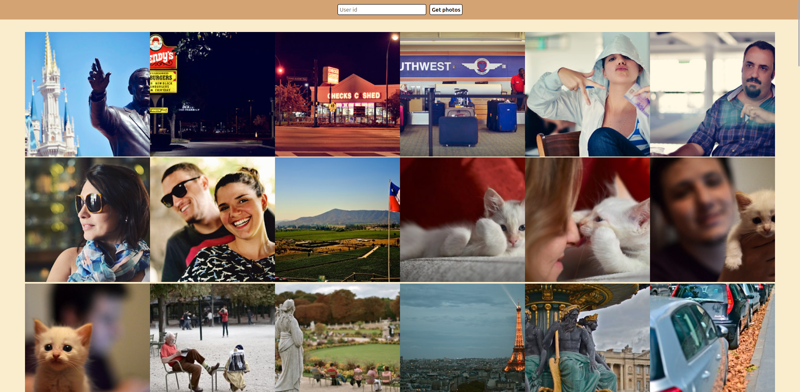

Working with external API. Type a number and obtain users with coresponding id photos.

[Project description](https://www.theodinproject.com/lessons/ruby-on-rails-flickr-api)

If you'll want to test the app:

Make sure you have ruby and ruby on rails installed

1. Clone from github and run these command inside project folder
2. ```$ sudo apt install libpq-dev```
3. ```$ gem install pg -v '1.4.2'```
4. ```$ bundle install```
5. Obtain flick api and secret keys [here](https://www.flickr.com/services/apps/create/)
6. In app > controllers > static_pages_controller.rb change "ENV["FLICKR_KEY"]" to flicker API key and "ENV["FLICKR_SECRET"]" to flicker secret key 
7. run ```$ rails s```

Preview

